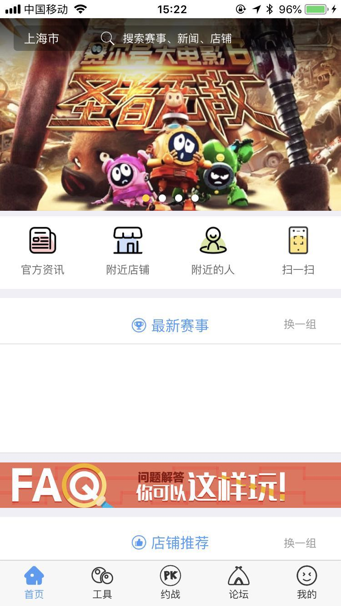
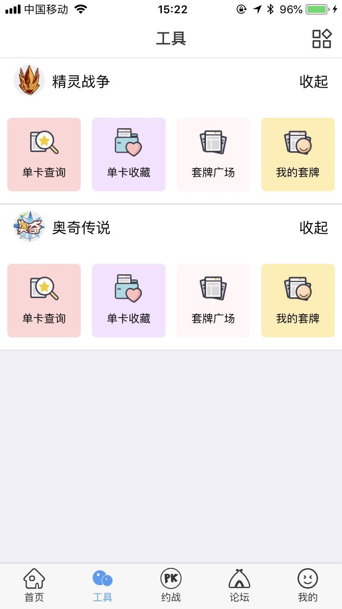
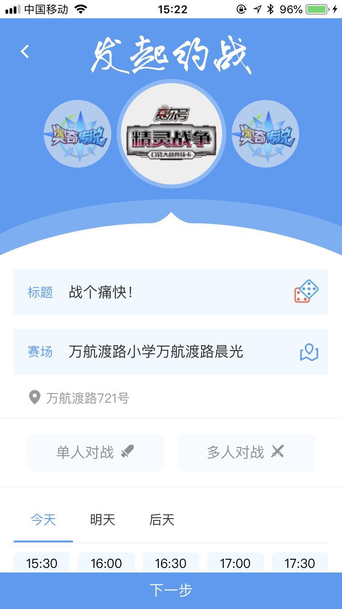
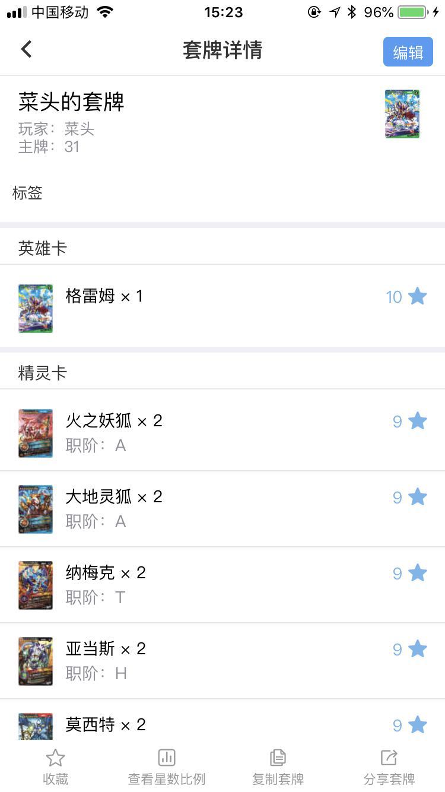
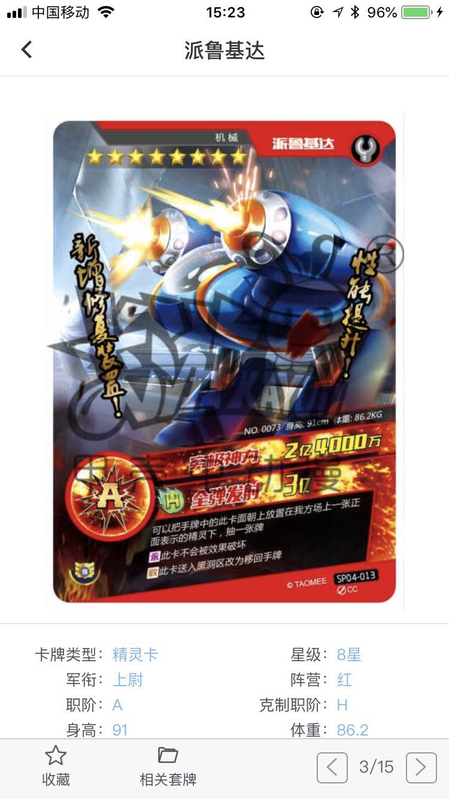
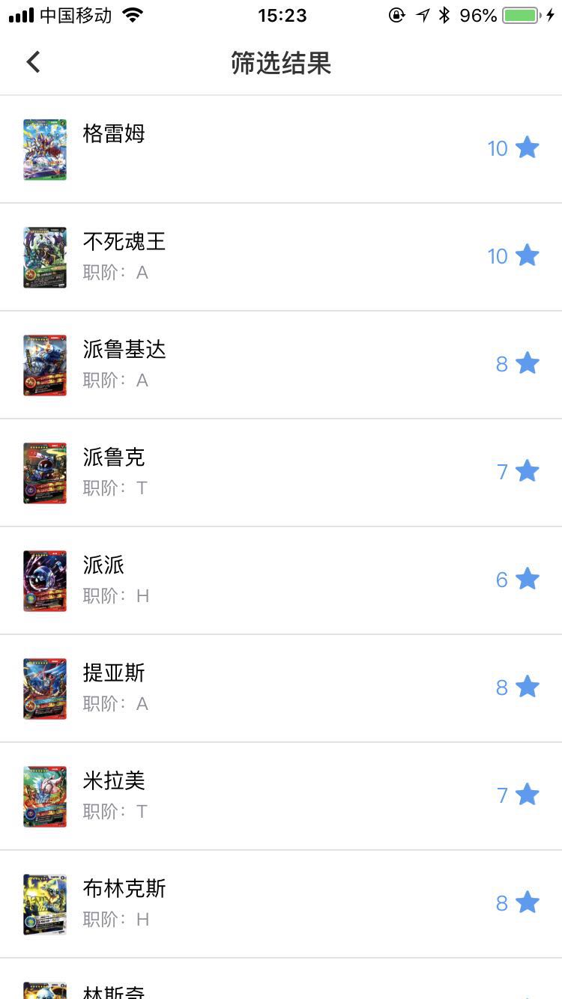
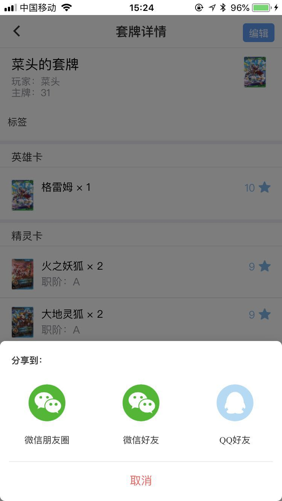

# 前言


初学mui时曾在网上搜索vue的实战项目源码，无奈大部分都是简单的demo，
对于深究mui没有太大的帮助，剩下的一些大部分都是像音乐播放器之类的展示型项目，交互没有预期那么复杂。
既然还没人用mui写过这样的项目，那不如我来写，开源出来对能看到的人也会有帮助。


## 项目运行


```
git clone https://github.com/EasyTuan/mui-kidApp.git

```

打开HBuider，打开项目

运行=>真机运行(需要usb连接手机)

# 目标功能
- [x] 定位功能 -- 完成
- [x] 选择城市 -- 完成
- [x] 展示所选地址附近商家列表 -- 完成
- [x] 搜索文章，赛事 -- 完成
- [x] 商家列表页 -- 完成
- [x] 店铺评价页面 -- 完成
- [x] 单张卡牌详情页面 -- 完成
- [x] 商家详情页 -- 完成
- [x] 登录、注册 -- 完成
- [x] 三方微信、QQ登陆 -- 完成
- [x] 修改密码 -- 完成
- [x] 个人中心 -- 完成
- [x] 发送短信、语音验证 -- 完成
- [x] 赛事列表 -- 完成
- [x] 赛事详情 -- 完成
- [x] 添加、删除、修改收货地址 -- 完成
- [x] 帐户信息 -- 完成
- [x] 服务中心 -- 完成
- [x] 红包 -- 完成
- [x] 上传头像 -- 完成
- [x] 卡牌对战发起 -- 完成

## 部分截图展示










# 说明

>  如果对您有帮助，您可以点右上角 "Star" 支持一下 谢谢！ ^_^

>  或者您可以 "follow" 一下，我会不断开源更多的有趣的项目

>  如有问题请直接在 Issues 中提，或者您发现问题并有非常好的解决方案，欢迎 PR 👍
