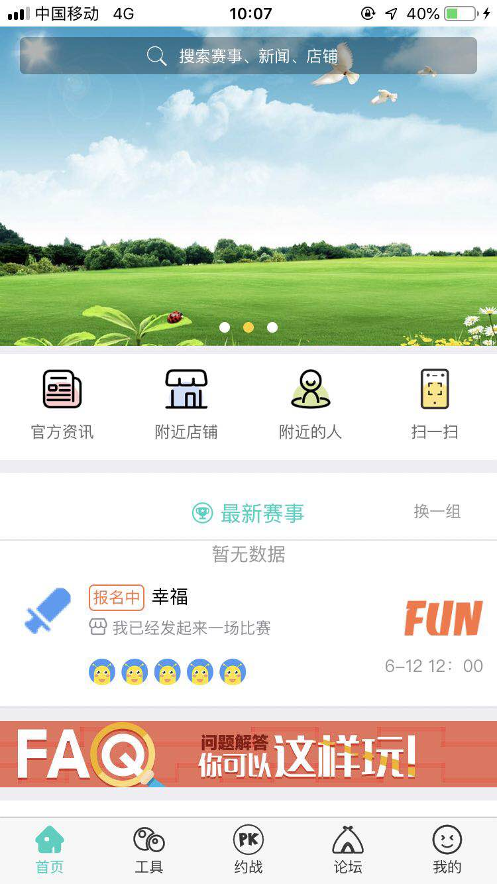
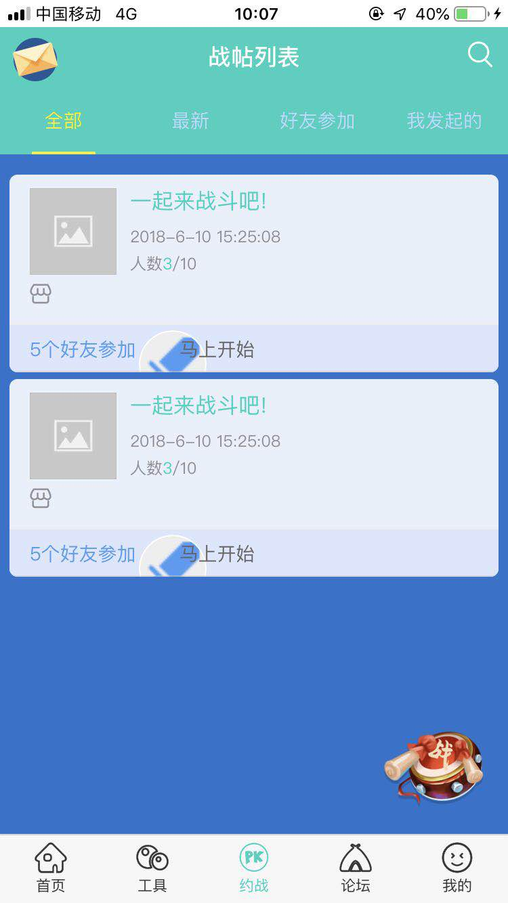
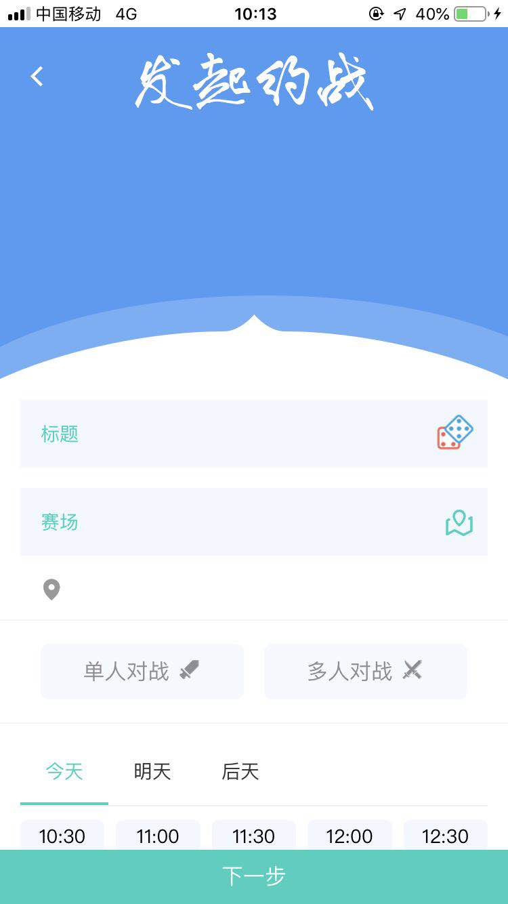
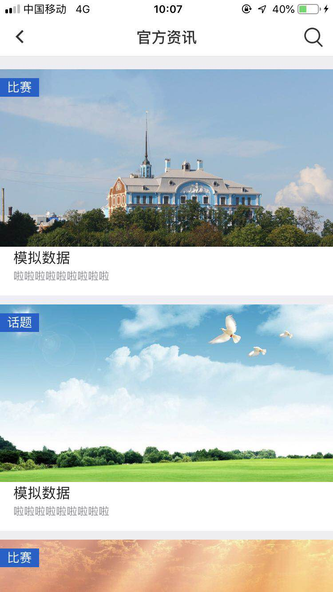
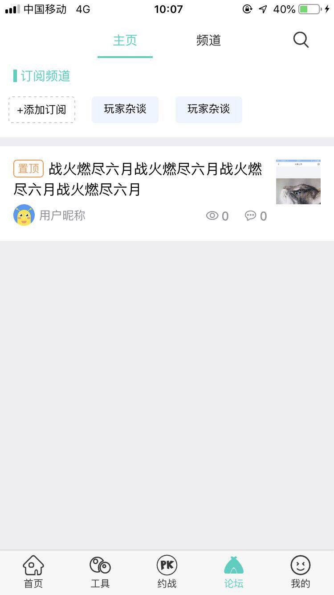
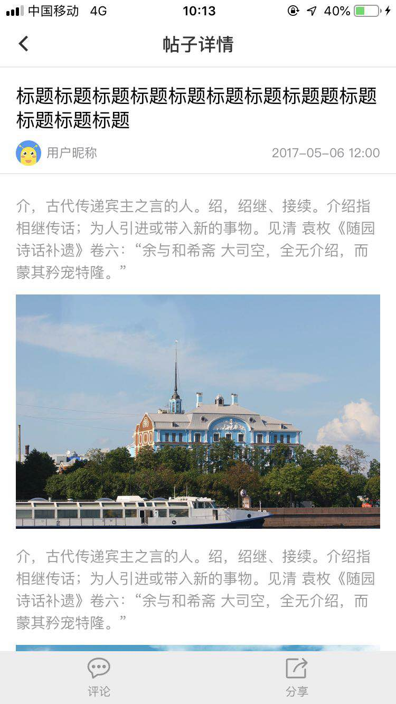
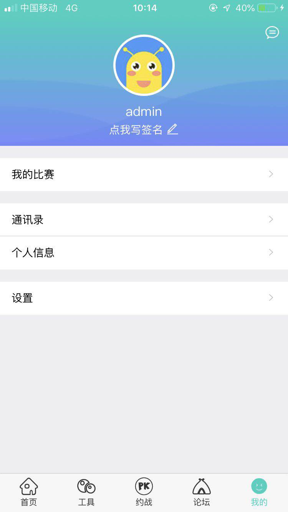
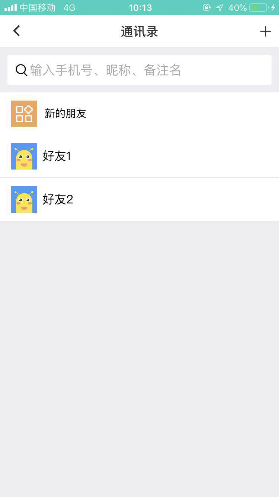

# 前言

mui是一款接近原生App体验的前端框架，只需要掌握前端技术就可以开发APP应用，官方有提供功能比较全面的demo版本，
但在实战中总会遇到一些不可避免但坑，对于没有接触过mui的开发者，难免会浪费很多时间在踩坑上。

该项目以mui为开发框架，artTemplate.js作为js模版引擎，没有繁琐的配置和编译过程，拿来就可以上手，适合刚接触mui的同学参考和学习

如遇网络不佳，请移步[国内镜像加速节点](https://gitee.com/easytuan/mui-kidApp)

## 项目运行

```

git clone https://github.com/EasyTuan/mui-kidApp.git

# 国内镜像加速节点:git@gitee.com:easytuan/mui-kidApp.git

```

打开HBuider，打开项目

右键项目=>转换为移动App

运行=>真机运行(需要usb连接手机)

注：服务器到期，接口服务不再支持，能正常登陆和退出，不影响正常功能但预览和学习


# 目标功能
- [x] 定位功能 -- 完成
- [x] 选择城市 -- 完成
- [x] 展示所选地址附近商家列表 -- 完成
- [x] 在高德地图中寻找店铺 -- 完成
- [x] 搜索文章，赛事 -- 完成
- [x] 商家列表页 -- 完成
- [x] 店铺评价页面 -- 完成
- [x] 单张卡牌详情页面 -- 完成
- [x] 商家详情页 -- 完成
- [x] 登录、注册 -- 完成
- [x] 三方微信、QQ登陆 -- 完成
- [x] 修改密码 -- 完成
- [x] 个人中心 -- 完成
- [x] 发送短信、语音验证 -- 完成
- [x] 赛事列表 -- 完成
- [x] 赛事详情 -- 完成
- [x] 添加、删除、修改收货地址 -- 完成
- [x] 帐户信息 -- 完成
- [x] 服务中心 -- 完成
- [x] 红包 -- 完成
- [x] 上传头像 -- 完成
- [x] 卡牌对战发起 -- 完成

# 业务介绍

入口地址为 `html/main.html`

目录结构

    ├── css						//css样式文件
    ├── fonts					//字体图标
    ├── html					//页面
    ├── images					//图片
    ├── js						//js
    │    └── lib					//js第三方库
    ├── unpackage				//App图标、启动页
    └── manifest.json			//App配置文件

## 部分截图展示

### 首页展示

 
### 对战发起 && 官方资讯

 
### 论坛 && 帖子详情

 
### 用户中心

 

# 说明

>  如果对您有帮助，您可以点右上角 "Star" 支持一下 谢谢！ ^_^

>  或者您可以 "follow" 一下，我会不断开源更多的有趣的项目

>  如有问题请直接在 Issues 中提，或者您发现问题并有非常好的解决方案，欢迎 PR 👍

# 赞助

如有帮助，欢迎赞助

收到赞助款后，我会及时更新[赞助墙](https://caibowen.net/sponsor)

 

# 友情链接

[该项目基于Ionic3.x的实现](https://github.com/EasyTuan/ionic-cordova-demo)

# License

[MIT](LICENSE)
